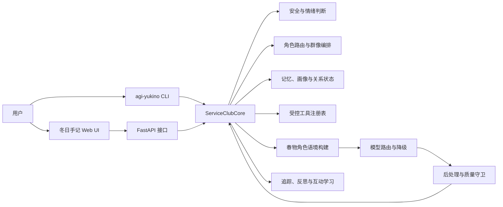
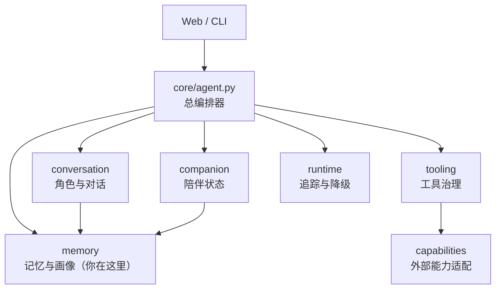
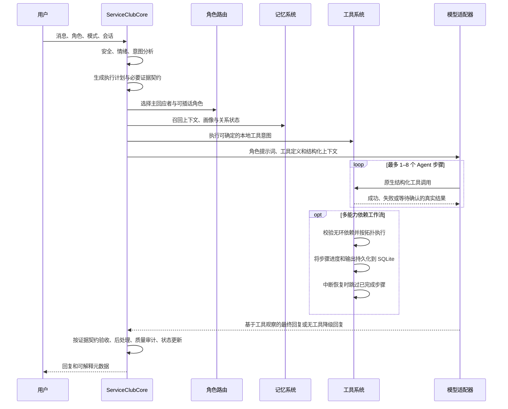
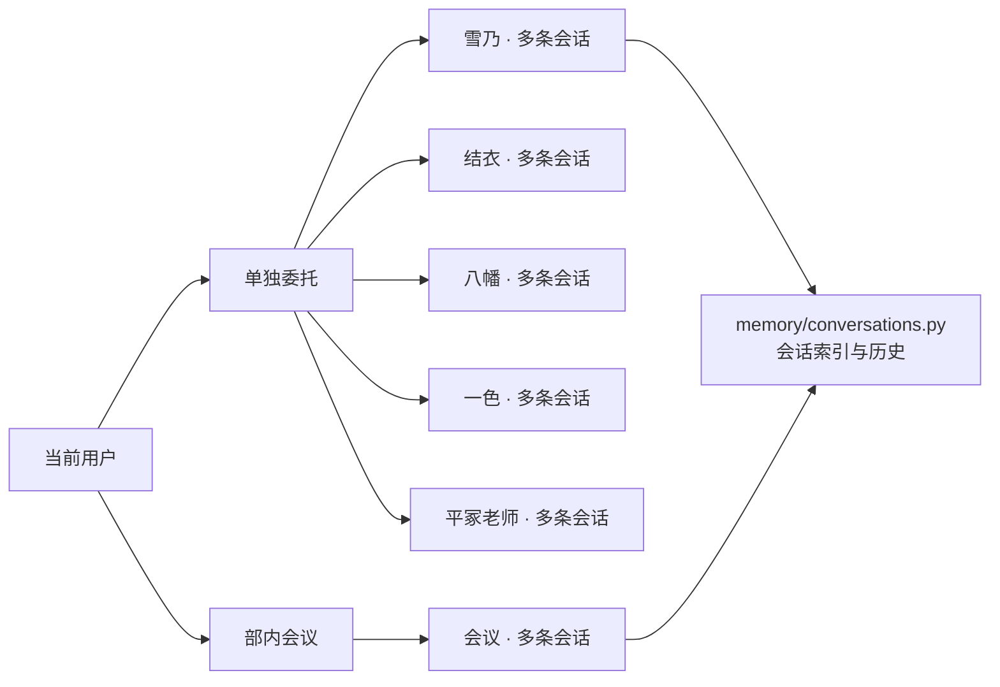

# AGI Yukino 架构

AGI Yukino 只有一套产品运行时：`service_club`。Web、CLI 和兼容启动器都通过公开入口调用它，不允许反向依赖界面层，也不允许依赖被移除的参考项目包。



## 目录边界

`ServiceClubCore` 是总编排器，领域实现按职责收进五个子包。新增功能应先判断属于哪个领域，不再把实现文件直接堆到 `core/` 根目录。

```text
service_club/
├── core/
│   ├── agent.py          # 一轮对话的总编排入口
│   ├── types.py          # 跨领域共享的请求、响应和枚举
│   ├── memory/           # 记忆存储、会话历史、召回、画像、反思和上下文
│   ├── conversation/     # 角色、路由、模型、提示词和回复治理
│   ├── companion/        # 情绪连续性、关系、主动关怀和互动学习
│   ├── tooling/          # 工具解析、注册、权限和执行
│   └── runtime/          # 自诊断、追踪、用量和运行时降级
├── capabilities/         # 文件、网页、Python、MCP 等受控能力适配器
├── web/                  # FastAPI 映射和静态前端
├── runtime_config.py     # 页面可修改的运行配置
└── settings.py           # 静态路径与默认配置
```



## 一轮对话



## 会话归属和历史

会话记录以服务端 SQLite 为准，不再把一个浏览器本地会话分给所有角色。单独委托按“角色 + 会话”隔离；部内会议拥有独立的会议会话列表。`conversation_threads` 保存标题、预览和更新时间，具体消息仍通过同一个 `session_id` 关联记忆表，因而切换或清理一条会话不会改动其他角色的历史。

提醒同样以 SQLite 为准。`scheduled → claimed → delivered` 使用限时领取租约：页面展示和服务端 Webhook 派送竞争同一份租约，因此不会由两条通道同时领取。未开启后台派送时仍由当前页面领取；开启后页面关闭也由服务生命周期内的 worker 派送。Webhook 使用稳定 `event_id`，失败进入退避重试，超过上限进入死信并释放提醒租约，提醒可回退到页面领取。重复提醒在确认送达后按原时区计算下一次本地时间，避免简单按 UTC 秒数累加造成夏令时漂移。

普通网页聊天通过 `agent.chat` 持久作业提交，由独立 worker pool 执行完整 Agent turn。领取事务会排除同一 session 的前序活动作业，所以同一会话严格串行、不同会话可按配置并行；总容量与单会话容量都在 SQLite 写事务内检查，满载返回 `429` 而不是无限堆积。浏览器只保存 session、request 和 job 标识并轮询安全摘要，因此刷新不会中断任务，并能显示队列位置。请求 ID 同时约束任务账本和队列幂等；运行中由心跳续租，服务启动会立即使旧进程孤儿租约到期。不确定的 Agent 副作用不会自动重放，迟到结果也不能覆盖停止状态。

`agent_task_events` 为每条任务保存单调游标的脱敏进度：创建、排队、计划、上下文准备、模型请求/失败/备用切换、工具步骤、确认、验收和终态。`/ws/runtime` 只允许按所属 `session_id` 订阅任务，并从客户端游标之后增量推送；REST 事件接口承担重连补偿和完整回放。前端同时消费两条路径并按事件 ID 去重，所以 WebSocket 断线不会丢进度，也不会因轮询与推送竞态重复显示。

`agent_tasks.checkpoint_json` 与 `checkpoint_revision` 保存模型观察循环的结构边界。一次原生工具循环依次写入 `model_waiting → tool_decision → tool_results_committed`，取得最终文本后写入 `response_ready`，任务验收后再封存 `outcome_*` 状态。记录只包含模型名、轮次、整段上下文 SHA-256、工具名、工具参数 SHA-256、步骤 ID 与状态；不包含 Prompt、模型隐式推理、工具参数或返回正文。恢复时从步骤账本生成最多 4000 字符的确定性证据上下文，副作用步骤明确禁止自行重放，只读结果允许按需重新获取。因此这是可验证的执行恢复，不是不可审计的“思维链续写”。

本地副作用还使用任务级幂等凭据与 `agent_effect_receipts` 对账。显式记忆、提醒和待办把由 `task_id + 操作指纹` 派生的键写入各自领域存储；首次文件创建先记录目标路径和预期 SHA-256，再原子写入。覆盖或编辑已有文件时，确认单还保存旧内容 SHA-256，真正执行前重新读取并比较；确认后由用户或其他进程产生的新版本不会被旧确认覆盖。若进程恰好在业务结果落盘后、步骤完成提交前停止，启动恢复会查询领域唯一键或校验文件指纹：证据一致则把原步骤认领为完成，目标明确不存在则标记为可安全重试，内容冲突或已确认外部操作仍保持 `interrupted`，绝不静默重放或覆盖。回执只保存结构证据，不保存文件正文、提示词或模型隐式推理。

确认后的外部副作用另由 `agent_external_dispatches` 记录 `operation_id → dispatch_id → provider_idempotency_key`。账本在网络调用前提交 `dispatching`，成功后只保存响应 SHA-256、延迟和允许列出的供应商回执 ID；HTTP 适配器传播稳定 `Idempotency-Key`/`X-AGI-Dispatch-ID`，MCP JSON-RPC 使用同一稳定请求 ID，SMTP 使用稳定 `Message-ID`。若进程在调用后、终态提交前退出，启动恢复把 dispatch 与 operation 分别改为 `uncertain` 和 `interrupted`，不会进入自动队列；如果 dispatch 的完成回执已经提交，则启动时自动把中断的 operation 和任务证据认领为完成。设置页按 session 隔离展示外发记录，人工“确认成功/放弃”在同一 SQLite 事务内同时关闭 dispatch 与 operation；显式重试原子恢复原 operation，领取成功后复用原 dispatch 和供应商幂等键。并发双击只有一个请求能领取。供应商不支持幂等语义时仍无法保证 exactly-once，因此不确定状态必须由用户核对。

MCP 有两条独立传输边界。HTTP JSON-RPC 使用固定 DNS、禁止重定向、响应 ID/版本校验和 2 MiB 上限；本机 stdio 由 `mcp>=2.1,<3` 官方 SDK 建立完整初始化与关闭生命周期。stdio 命令在进入 SDK 前解析为绝对可执行文件，但保留虚拟环境启动器，不拼接 Shell 字符串；服务配置、参数、工作目录、环境变量、超时和数量都有上限。SDK 只继承基础运行环境，服务密钥按服务单独保存，禁止覆盖 PATH、HOME、PYTHONPATH、NODE_OPTIONS 等进程边界。stderr 由持续排空的有界管道接收，内容不进入 API、任务错误或审计；停止与超时会取消生命周期并由 SDK 清理子进程。即使只是 `tools/list`，启动本机可执行文件也必须经过确认。

持久确认单不是一个脱离配置的布尔开关。系统任务、MCP、邮件、媒体、插件和工作流会把当时的非秘密执行目标规范化后计算 SHA-256，并与确认单一起保存；真正执行前从当前配置重算，命令、工作目录、超时、服务地址或插件权限发生变化都会拒绝旧确认。秘密值不进入指纹，避免低熵凭据被离线猜测；秘密轮换仍由目标权限、外发账本和服务端鉴权约束。固定系统任务只接受预配置参数数组，工作目录只能选择内部工作区或项目根目录，永不经过 Shell。

`service_club.sqlite3` 中的能力策略表是执行前的最终权限闸门。旧版 `capability_policy.sqlite3` 与 `workflow_runs.sqlite3` 会经 `storage_schema_migrations` 一次性迁入主库，源文件作为可恢复备份保留，运行时不再继续分库写入。缺省策略为允许；显式 deny 可作用于整项 capability 或某个 action。deny 只可由绑定 `session_id`、精确到 action、带到期时间和剩余次数的临时 grant 覆盖。执行使用 `BEGIN IMMEDIATE` 原子领取并扣减 grant，预检与创建确认单只读不扣次数；风险动作仍必须独立满足 `confirmed=true`。通用能力网关、原生工具包装、直接 HTTP 执行以及同步/后台工作流子步骤最终都进入 `CapabilityHub.execute`，因此策略不能通过换入口绕开。删除或清空会话会同时删除其 grant，但不会改变全局 deny 规则。完整存储选型与 PostgreSQL 演进约束见 [存储架构](STORAGE_ARCHITECTURE.md)。

`ToolOutputSecurity` 在模型上下文之前建立数据/授权边界。网页、文档、文件检索、MCP/插件通用能力和记忆召回结果被标为 `untrusted`，移除不可见控制字符后装入 JSON 数据信封，并限制单项最多 24,000 字符；审计只保留来源、字符数、SHA-256 和检测信号。原生 tool calling 与兼容 DSML 在执行任何记忆、提醒、待办、文件写入或外部副作用前，必须匹配 `AgentExecutionContract` 中由本轮用户原话确定的 side-effect requirement，工具正文不能新增授权。若不可信内容命中指令覆盖、角色伪装、密钥外传、工具强迫或授权伪造信号，即使原契约允许该动作，本轮后续副作用也冻结；只读分析仍可继续，新的用户消息会建立新的契约。安全拦截写入脱敏任务事件，不记录正文。

`PythonLab` 使用双层隔离。第一层在父进程解析 AST，拒绝导入、反射、异常/上下文管理器、生成器帧、双下划线对象图以及白名单外模块/对象属性；子解释器只注入裁剪后的 builtins 与 `math`/`statistics` 代理。第二层在 macOS 上通过 `sandbox-exec` 加载 `(deny default)` 策略，只放行 Python 基础解释器及运行库读取，不放行用户目录/工作区文件、网络和其他可执行文件；子进程还设置 CPU、地址空间、文件大小、文件描述符、进程数和 core dump 限制，标准输出先写入受限临时文件再截取尾部。严格模式找不到系统后端时在执行前失败关闭。显式 `language` 模式仅供外层容器已经完成强隔离的开发/CI，状态始终标记为 degraded，产品环境不能把它当作安全后端。

确定性意图步骤与模型工具循环之间还有一条副作用交接边界。若本轮所有副作用要求已经由 pre-model 工具取得成功证据，模型请求不再携带工具定义，只允许整理已有证据；供应商仍返回未提供的原生 tool call 会在模型适配层拒绝，兼容文本中的副作用工具标记会被记录为 deduplicated 而不执行。这样避免“文件已经创建，模型又写一次而触发覆盖确认”的双执行。最终验收把“副作用真实结果”和“自然语言整理质量”分开：只有全为副作用的要求都具有成功且非待确认的证据时，模型超时仍可标记操作 completed，同时在响应元数据保留 degraded 与具体原因；代码分析等依赖模型语义整理的只读任务仍保持 degraded。

`agent_tasks.budget_json` 保存任务创建时的时长、模型次数、Token、费用、工具次数与最大输出快照，`usage_json` 保存实际、预占和不确定用量。模型并发调用在请求前通过 SQLite 写事务原子预占 Token/费用，返回后按供应商 usage（缺失时使用保守估算）结算；已经发出但本地超时或停止等待的请求保留为不确定用量。排队、等待用户确认和后台等待不计入实际执行时长。超限不会切换备用模型或重放工具，用户提高设置后可在原 `task_id` 上恢复，累计用量与证据不清零。

`ServiceClubCore` 允许不同 Agent turn 并行，但热重载使用写优先读写门闩：保存设置会等待已进入的轮次结束、阻止新轮次进入，完整构建新 model/capabilities/tools/retriever 后再一次切换。运行追踪、降级窗口、路由统计、用量账本、心智状态与永久记忆的进程内共享状态均受锁保护。

模型调用按模型名维护独立健康状态。失败被归一为 timeout、authentication、model-not-found、rate-limit、provider、network、invalid-request 或 empty-response；连续失败达到阈值后打开熔断，冷却结束只允许一个 half-open 探针。主模型在任何工具执行前失败时，可以切换用户显式配置的备用模型；若已经获得工具结果，则保留证据并终止本轮模型生成，绝不从头交给备用模型重放。每轮 `model_runtime` 记录实际模型、fallback、尝试序列和安全分类，设置页的主/备用模型测试也调用同一运行时入口。

QQ、微信和通用 Webhook 入站请求使用独立签名密钥。服务对 `timestamp + "." + raw_body` 做 HMAC-SHA256 校验，限制 5 分钟时间窗，并把 `(channel, event_id)` 写入 SQLite 唯一账本后才进入 Agent。重复事件在模型或工具执行前被拒绝，服务重启不会清空防重放记录。

`background_jobs` 是长任务和离线派送共用的持久账本，状态为 `queued → running → completed`，失败则进入 `retry_wait`，超过上限进入 `dead_letter`。领取使用租约，运行中停止会让迟到结果无法提交。工作流 `enqueue` 在用户确认后只创建工作流记录和后台作业，聊天请求立即返回 `waiting_background`；worker 完成后把工具证据回写原委托与确认委托的同一任务账本，再重新执行完成验收。若服务在有副作用的步骤中断，工作流只标记 `interrupted`，不会自动重放。

失败、降级、停止或安全中断的 Agent 任务通过原 `task_id` 恢复，不复制成新账本。恢复请求使用新的 `request_id` 做并发与响应幂等，但原步骤、确认结果、副作用指纹与最近结构恢复点全部保留。状态为 `interrupted` 的副作用步骤按结果不确定处理，默认拒绝重放，只有用户检查外部状态并显式允许后才会继续。



## 依赖规则

1. `service_club.core` 不导入 `service_club.web`。
2. `service_club.web` 只做 HTTP 映射和静态资源服务。
3. `core/agent.py` 可以组合领域包；领域包不能反向导入 `core/agent.py`。
4. 跨领域共用的数据结构放在 `core/types.py`，不要复制类型。
5. CLI 只通过 `ServiceClubCore` 和 `runtime/doctor.py` 的公开接口工作。
6. 用户数据默认只写入 `YUKINO_DATA_DIR`；只有设置页明确授权的目录可以被 Agent 创建文件，已有文件覆盖或修改仍需逐次确认。
7. 网页研究拒绝 IP 直连、私网/保留地址和内部域名；对于 macOS 代理常见的 `198.18.0.0/15` Fake-IP DNS，仅在公共探测域也落入该段时启用兼容，HTTP 目标仍保留域名、协议、凭据和重定向限制。
7. 新能力必须先定义产品语义和权限，再接外部平台适配器。
