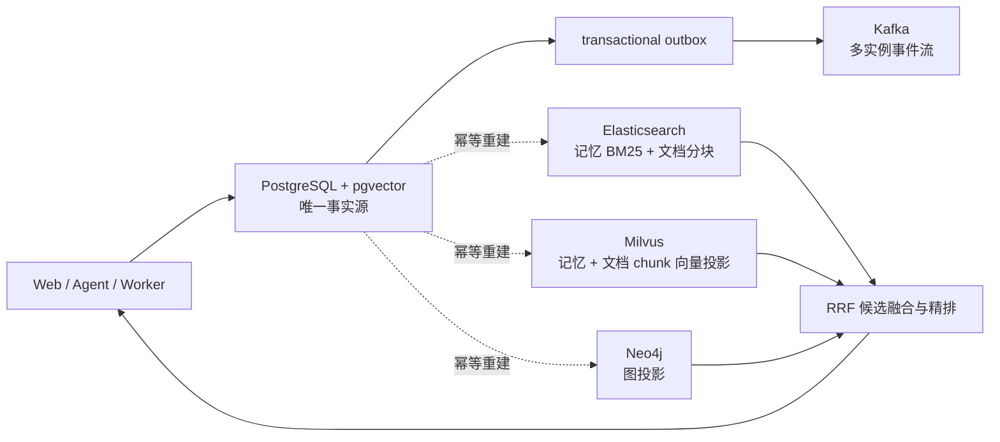

# 存储架构与演进

## 设计结论

AGI Yukino 不再提供 SQLite 运行模式。生产运行时固定为以下职责边界：

1. **PostgreSQL + pgvector 是唯一事实源**：会话、记忆、文档、任务、权限、幂等、审计、outbox、向量原文和图谱关系都只在这里裁决。
2. **Elasticsearch 是词法检索投影**：保存记忆与独立知识库文档分块的 BM25 索引，可从 PostgreSQL 全量重建。
3. **Kafka 是事件传输层**：PostgreSQL 事务内先写 outbox，多实例 dispatcher 使用 `FOR UPDATE SKIP LOCKED` 领取并至少一次投递。
4. **Milvus 与 Neo4j 是可选投影**：分别扩展记忆/知识库 chunk 的语义检索和图遍历，不成为新的事实源。



## 混合记忆检索

查询不再从数据库取“最近/最重要的 200 条”后在 Python 中做全量 BM25。新流程是：

1. Elasticsearch 以 `session_id` 精确过滤，召回 BM25 候选；
2. 配置 Embedding 与 Milvus 时，以同一 `session_id` 召回语义候选；
3. 合并候选 ID 后回 PostgreSQL 校验正文仍存在且属于当前会话；
4. 使用 RRF 融合排名，再叠加中文片段、概念、图谱、重要度及时效信号；
5. 最终命中才进入 Prompt，Elasticsearch/Milvus 中的陈旧或越权记录无法单独成为回答证据。

独立知识库使用 `knowledge_documents` 和 `knowledge_chunks` 保存规范事实，chunk 的 embedding 原文和模型指纹也保存在 PostgreSQL；Elasticsearch 使用独立的 `*_documents_v1` 索引，Milvus 使用独立的 `*_document_*` 集合族。大文档先分块，避免把原始二进制或超大正文直接写入索引。

知识库 chunk 的向量写入在文档事实提交和 Elasticsearch 投影之后执行，Embedding 服务或 Milvus 暂时不可用时不影响文档落库；后续可通过 `agi-yukino storage rebuild-vectors --confirmed` 从 PostgreSQL 中的 embedding 重新投影。

知识库 API：

- `POST /api/knowledge/documents`：确认后写入文本并自动分块；
- `GET /api/knowledge/search?knowledge_base=...&query=...`：按知识库隔离搜索；
- `POST /api/knowledge/documents/delete`：确认后删除 PostgreSQL 事实并清理索引。

## 事件一致性

记忆创建/删除与任务进度事件在业务事务内写入 `event_outbox`。dispatcher 先领取 outbox 行，再用会话或任务 ID 作为 Kafka key 发布；Kafka producer 开启幂等、`acks=all` 和批处理压缩。若进程在发布后、回写 `published_at` 前崩溃，事件可能重复，因此消费者必须按 `event_id` 幂等处理。

这提供的是“数据库提交后不会静默丢事件”的至少一次语义，不虚构跨 PostgreSQL/Kafka 的 exactly-once。

每个 Web 实例使用独立 consumer group 接收任务事件通知，并只唤醒本实例上的 WebSocket；正文和游标仍回 PostgreSQL 读取。Kafka 通知漏失时 WebSocket 每 5 秒执行一次游标补偿，因此通知吞吐和事实恢复彼此解耦。

## 本地启动

```bash
cp .env.example .env
export YUKINO_POSTGRES_PASSWORD='请使用强随机密码'
export YUKINO_MINIO_PASSWORD='请使用强随机密码'
export YUKINO_NEO4J_BOOTSTRAP_PASSWORD='请使用强随机密码'
docker compose up -d
```

直接在宿主机运行应用时，使用 `.env.example` 中的 `127.0.0.1:5433`、`:9201` 和 `:9093` 地址。容器运行时 compose 会改用 `postgres:5432`、`elasticsearch:9200` 与 `kafka:9092`。

```bash
agi-yukino storage status --json
agi-yukino storage search-status --json
agi-yukino storage rebuild-search --json
agi-yukino storage vector-status --json
agi-yukino storage rebuild-vectors --drop-existing --confirmed --json
```

## 从旧 SQLite 导入

SQLite 代码仅保留在 `service_club.storage.legacy_sqlite` 的离线导入边界，任何运行时仓储都不会导入它。先备份旧文件，再执行：

```bash
export YUKINO_POSTGRES_DSN="$YUKINO_DATABASE_URL"
agi-yukino storage migrate-control-plane \
  --source-sqlite ./data/service_club.sqlite3 --dry-run --json
agi-yukino storage migrate-control-plane \
  --source-sqlite ./data/service_club.sqlite3 --confirmed --json
agi-yukino storage rebuild-search --json
```

导入完成后旧文件不参与运行。地址缺失、格式错误或 PostgreSQL 不可用时启动直接失败，不会创建临时数据库或静默降级。

## 与 agi-saber 的关系

这里借鉴其 PostgreSQL、Elasticsearch、Kafka、Milvus、Neo4j 分工，但修正了几个关键边界：候选和图谱均强制会话隔离；PostgreSQL 始终仲裁事实；索引可重建；事件使用 transactional outbox；检索通道真正独立产候选并用 RRF 融合，而不是名字叫“并行/混合”但仍串行扫描固定候选。
