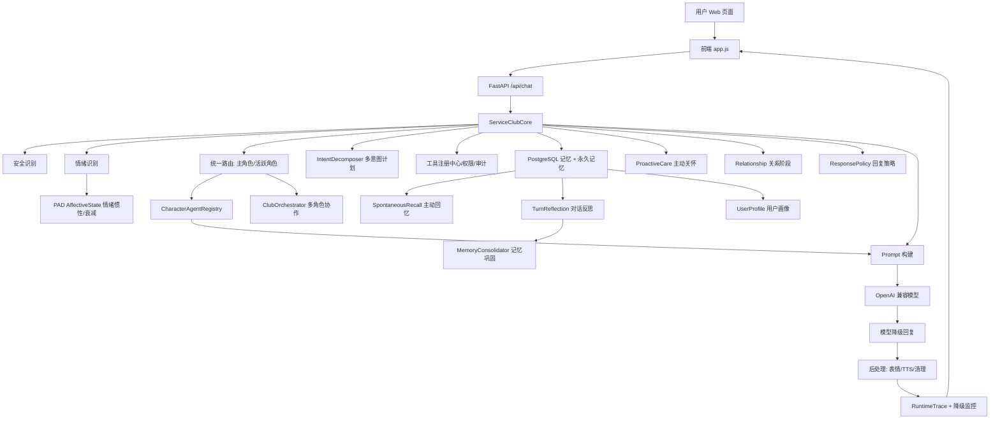

# 春物情感陪伴 Agent 完整开发说明

本文档描述如何从一个普通聊天 Web 项目，实现一个参考 `agi-yukino` 工程思路的《春物》情感陪伴 Agent。目标不是复制原项目体量，而是把它的关键能力压缩成一个可运行、可改造、可继续扩展的个人陪伴 Agent。

项目位置：克隆后的 `agi-yukino/` 目录。

运行入口：

```bash
cd agi-yukino
source .venv/bin/activate
agi-yukino serve --reload
```

浏览器打开：`http://127.0.0.1:8082`

## 1. 项目目标

这个 Agent 要满足以下能力：

- 用户可以在 Web 页面中交互聊天。
- Web 会持久化会话 ID 与最近消息，刷新后继续使用同一个陪伴会话。
- 用户可以选择《春物》里的不同角色。
- 支持单角色私聊和侍奉部活动室群聊两种模式。
- 每个角色都有不同人格、说话方式、安慰方式和降级回复。
- 能识别用户情绪，并把情绪传入 Prompt。
- 能保存和召回显式记忆。
- 清空记忆必须明确确认，并完整清理该会话的对话、情绪、提醒、关系、画像和行为学习数据。
- 能按关键词精确忘记显式记忆和匹配的永久记忆，允许用户撤回具体记忆。
- 能根据当前话题和情绪主动带出相关旧记忆，让陪伴有连续感。
- 能在每轮结束后沉淀对话反思，记录“用户状态 + Agent 怎么回应”。
- 能把高显著反思自动巩固为永久记忆，跨会话继续可用。
- 能阻止危机/高风险反思进入永久记忆，避免把敏感状态长期保存。
- 能根据有效互动证据、信任分、支持成功和用户边界维护关系，而不是把聊天轮数直接当成信任。
- 能识别关系破裂与修复信号；负反馈后先承认影响、降低角色扮演、暂停主动联系，修复需要多次不同证据。
- 能在每轮回复前生成可审计的回复策略，控制开场、建议方式、提问预算、角色扮演强度和安全指令。
- 能从身份、语气、态度、边界和策略五个维度审计模型输出，确定性修复人格串台、系统身份泄露、排他依赖、越界亲密、先说教和连续追问。
- 能只用问题类型和输出哈希积累回复质量案例；同类问题重复后，下一轮自动注入内部改进约束，不保存或复述完整坏回复。
- 能把用户对上一轮陪伴的明确正负反馈关联到当时的回复策略，形成 Agent-R 风格的互动结果学习；模糊反馈、危机文本、重复证据和过期教训不会污染策略。
- 能为每个 session + 角色维护可追溯的自我连续性和成长叙事；只从关系、边界和已验证策略证据生成，不让模型自由编造日记。
- 能检查最终回复是否执行了策略，危机场景缺少现实求助/不要独处时自动补强。
- 能在连续低落或危机时生成主动关怀候选，指导下一轮回复节奏。
- 能把一句话里的多个动作拆成工具计划，例如“记住偏好，然后提醒我休息”。
- 能维护有证据、可冲突替换、可撤销且受隐私门保护的动态用户画像。
- 能用 BM25、中文字符片段、概念语义、重要度、时效和可选 embedding 混合召回记忆，并解释每次命中的分数组成。
- 能执行少量工具，例如当前时间、记住、回忆、清空记忆。
- 对高风险工具做确认保护，例如清空记忆必须明确确认。
- 模型不可用、无 API Key、表情缺失、TTS 未启用时，必须继续返回纯文本陪伴。
- 对危机和高风险内容降低角色扮演强度，优先现实安全。

## 2. 和 agi-yukino 的能力映射

`agi-yukino` 是一个更复杂的 Agent 系统，包含路由、工具、长期记忆、降级策略、自诊断等能力。本项目采用“小而完整”的方式实现同类主链路。

| agi-yukino 能力 | 本项目对应模块 | 做法 |
| --- | --- | --- |
| 路由 / 编排 | `service_club/core/agent.py` | `ServiceClubCore.process()` 串起完整请求链路 |
| 统一路由 | `service_club/core/conversation/routing.py` | 私聊与 `@角色` 尊重用户选择；活动室支持 manual/adaptive，按语义与历史 belief 选主角色 |
| 角色人格 | `service_club/core/conversation/characters.py`、`conversation/character_agent.py` | 每个角色有 profile，并被包装成独立 CharacterAgent |
| 多 Agent 协作 | `service_club/core/conversation/club_orchestrator.py` | 区分候选与实际发言者，按场景规划 1-3 人的 lead/support/contrast 分工；主角色先答、补充角色并行，最终去重合并并在降级时短路 |
| 多意图计划 | `service_club/core/conversation/intent.py` | 把一句用户话拆成多个 `IntentStep`，顺序执行多个工具 |
| Prompt 注入 | `service_club/core/conversation/prompts.py` | 把模式、角色、情绪、记忆、工具结果写入系统提示词 |
| 上下文预算 | `service_club/core/memory/context_window.py` | 估算 token、保留最近消息、生成只读摘要检查点并审计超限降级 |
| 情绪识别 | `service_club/core/conversation/emotion.py` | 规则识别 happy/sad/anxious 等标签 |
| PAD 连续情绪 | `service_club/core/companion/affective_state.py` | 将当轮标签映射到 P/A/D，按 session 混合、衰减、持久化并生成支持信号 |
| 记忆系统 | `service_club/core/memory/` | PostgreSQL 唯一事实源；Elasticsearch BM25 与 Milvus 向量独立产候选，RRF 融合后叠加 CJK、概念、图谱、时效和重要度精排 |
| 主动回忆 | `service_club/core/memory/spontaneous_recall.py` | 消费混合检索结果和当前情绪，生成带来源、原因和分数的主动回忆 |
| 对话反思 | `service_club/core/memory/reflection.py` | 每轮保存短摘要、情绪、角色、显著性，形成连续陪伴轨迹 |
| 记忆巩固 | `service_club/core/memory/memory_consolidation.py` | 高显著反思自动写入永久记忆；高风险/危机内容会被隐私护栏拦截 |
| 关系模型 | `service_club/core/companion/relationship.py` | PostgreSQL 持久化信任、互动质量、支持证据、明确边界、破裂/修复；用证据门槛生成 new/warming/familiar/trusted |
| 回复策略 | `service_club/core/conversation/response_policy.py` | 每轮生成 opening/advice/question/roleplay/safety 策略，检查最终回复并写入审计 |
| 人格一致性与质量学习 | `service_club/core/conversation/response_quality.py` | 五维审计并执行有界修复；哈希化保存失败类型，重复问题生成下一轮内部教训 |
| 互动结果反思 | `service_club/core/companion/interaction_outcome.py` | 将用户后续明确反馈关联到上一轮策略；证据去重、危机拦截、门槛晋升和时效失活后注入策略教训 |
| 自我模型与成长叙事 | `service_club/core/companion/self_model.py` | 按 session + 角色从关系里程碑、边界、活跃本能和重复策略证据生成每日结构化检查点；不保存对话正文，不使用自由 LLM 日记 |
| 主动关怀 | `service_club/core/companion/proactive_care.py` | 根据 mental state 和 safety level 生成 gentle follow-up 或 crisis grounding 候选 |
| 离线回访 | `service_club/core/companion/proactive_nudge.py` | 连续负面情绪后创建可领取的持久化任务；执行 DND、冷却、每日上限和回归撤销 |
| 用户画像 | `service_club/core/memory/profile_facts.py`、`memory/user_profile.py` | 只学习明确事实，保存证据哈希、置信度、冲突历史和互动统计；支持撤销与隐私拦截 |
| 工具系统 | `service_club/core/tooling/` | 中文意图解析、工具 manifest、权限检查、记住/回忆/精确忘记、提醒/nudge、DSML 工具调用提取、参数修复与执行 |
| 降级策略 | `service_club/core/conversation/llm.py`、`runtime/degradation.py`、`runtime/runtime_degradation.py`、`conversation/postprocess.py` | 模型失败返回角色固定回复，媒体缺失返回空字段，运行时根据失败/延迟升降级 |
| 运行时审计 | `service_club/core/runtime/runtime_trace.py` | 记录每轮路由、工具、记忆、降级、延迟 |
| 路由反馈 | `service_club/core/conversation/route_feedback.py` | PostgreSQL 持久化成功/失败与延迟，维护 Beta belief，并参与活动室自适应路由 |
| 自诊断 | `service_club/core/runtime/doctor.py` | 输出 memory/tools/agents/router/degradation 健康报告 |
| 心理状态 | `service_club/core/companion/mental_state.py` | 将每轮情绪写入 PostgreSQL，按会话恢复主导情绪、低落连续度和 follow-up 信号 |
| 偏好学习 | `service_club/core/companion/preference_learning.py` | 从“以后叫我…”“我喜欢…”中提取称呼和陪伴风格偏好 |
| 行为本能 | `service_club/core/companion/behavior_instinct.py` | 重复证据晋升互动假设，支持反馈强化、有效置信度衰减、归档和用户撤销 |
| Web API | `service_club/web/app.py` | FastAPI 提供页面、角色、聊天、记忆、画像、诊断接口 |
| 前端交互 | `service_club/web/templates/index.html`、`static/app.js` | 角色选择、模式切换、聊天提交、状态展示 |

## 3. 总体架构

### 3.1 自适应角色路由

活动室默认使用 `routing_mode=adaptive`。路由总分由四部分组成：角色与当前文本的语义亲和度占 60%，Beta 后验期望成功率占 25%，延迟分占 5%，用户当前选择的角色先验占 10%。语义规则把情绪接纳、分析拆解、低社交压力、行动推进和轻快聊天分别映射到最适合的角色；反馈只负责纠偏，不会让历史快但人格不匹配的角色轻易抢走明显的情绪陪伴任务。

每个角色从 `Beta(1, 1)` 开始。成功后增加 alpha，主角色自身降级后增加 beta；活动室次要角色失败不会错误惩罚主角色。统计写入 `agent_route_stats`，重启后继续学习。`route_scorecard` 和 trace 会保留 `semantic`、`expected_success`、`latency_score`、`observations`、`selected_prior` 与 `total`，因此路由不是黑箱。

硬优先级始终是：`@角色` > solo 所选角色 > manual 所选角色 > adaptive 评分。PostgreSQL 不可写时事务失败关闭，避免多实例各自产生分叉反馈；只有纯内存语义路由可继续使用默认先验。



典型请求链路：

1. 用户在页面输入一句话。
2. 前端带上 `messages`、`chat_mode`、`character`、`session_id`、表情/语音开关，请求 `/api/chat`。
3. 后端读取最新用户消息。
4. `RuntimeTraceStore` 创建 trace。
5. `ServiceClubRouter` 根据私聊/活动室/@角色 mention 决定主角色和活跃角色。
   `routing_mode=adaptive` 时活动室计算角色 scorecard；manual、solo 和 mention 不自动改选。
6. 根据文本推断对话模式和安全等级。
7. 识别情绪。
   同时把当轮标签映射到 PAD，和 session 既有状态混合，得到跨轮持续情绪。
8. `IntentDecomposer` 把用户话拆成工具计划，例如先 `remember` 再 `set_reminder`。
9. 根据主角色工具权限顺序执行工具；清空记忆等风险工具会先过 guardrail。
10. 召回 PostgreSQL 记忆和永久记忆。
11. `SpontaneousRecallEngine` 根据当前话题和情绪主动追加相关旧记忆。
12. `MentalStateTracker` 更新情绪连续状态。
13. `ProactiveCarePlanner` 根据连续低落或危机等级生成主动关怀候选。
14. `ReunionPlanner` 检查本次输入前的最后一轮对话；相隔 30 分钟以上时，按中离/长离、离开前情绪和话题生成重聚上下文。危机场景不生成重聚提示。
15. `RelationshipTracker.observe()` 读取当前原话，记录普通互动、正负反馈、支持成功、明确边界或修复证据；再按信任、质量和证据门槛生成关系阶段。
16. `ResponsePolicyPlanner` 生成回复策略，例如先共情、只问一个问题、小步建议、危机优先。
17. `InteractionOutcomeLearner` 检查当前原话是否是对上一轮陪伴的明确反馈；若安全且不重复，关联上一轮策略快照。达到证据门槛的角色策略教训与最近反思、主动关怀、重聚上下文、关系阶段、回复策略一起注入模型上下文。
18. `SelfModelManager` 读取实际候选角色已有的结构化检查点，将极短的角色连续性摘要注入 Prompt；高风险和危机轮次只读不写。
19. `ContextWindowManager` 按预算保留最近完整消息，将更早历史变成只读摘要；业务解析始终使用未压缩原文。
20. 通过 `CharacterAgentRegistry` 调用主角色 Agent。
21. 构建系统 Prompt。
22. 调用模型；活动室先由 `ClubTurnPlanner` 按安全、安静、情绪和明确群聊请求决定 1-3 人发言预算及 lead/support/contrast 分工。执行采用两阶段 DAG：主角色先答，补充角色都读取主回复后并行生成，最终按计划顺序去重合并；重复或降级的次角色会被省略。
23. 扫描模型回复里的 DSML 工具调用，例如 `<tool_call name="remember">...</tool_call>`。
24. 允许的 DSML 工具会经 `ServiceClubToolRegistry` 执行，并写入 audit。
25. 如果模型不可用，返回角色固定降级回复。
26. 清理 DSML 后，`ResponseQualityGuard` 从身份、语气、态度、边界、策略五维审计文本；严重人格问题使用当前角色安全回复，其余问题执行局部替换、共情前置、问题裁剪或长度裁剪。
27. `ResponsePolicyEnforcer` 最后检查最终回复。危机场景缺少必须项时追加安全补强；关系破裂时模型若忽略修复要求，会补上承认影响和简短道歉。这个顺序保证质量修复不能删掉安全兜底。
28. 尝试选择表情和 TTS；没有资源就返回 `null`。
29. 保存对话日志、本轮策略哈希快照和对话反思，为下一轮结果归因提供依据。
30. `MemoryConsolidator` 判断反思显著性，高于阈值就写入永久记忆。
31. `SelfModelManager` 只为本轮实际发言角色更新当天成长检查点。
32. 完成 trace，更新运行时降级监控。
33. 返回完整 JSON 给前端展示，包含 `context_window`、`intent_plan`、`spontaneous_recalls`、`proactive_care`、`response_policy`、`policy_audit`、`quality_audit`、`interaction_learning`、`self_model`、`club_orchestration` 和 `companion_state`。

## 4. 核心目录

```text
service_club/
  core/
    agent.py              # 主编排器，只负责串联领域模块
    types.py              # 跨领域共享类型
    memory/               # 记忆领域
      store.py            # PostgreSQL 会话、状态和显式记忆
      permanent_memory.py # 跨会话永久记忆
      hybrid_retrieval.py # 混合召回
      embeddings.py       # 可选向量适配器
      context_window.py   # 上下文预算和摘要检查点
      reflection.py       # 对话反思
      memory_consolidation.py # 高显著反思巩固
      spontaneous_recall.py   # 主动回忆
      profile_facts.py    # 动态画像事实
      user_profile.py     # 用户画像摘要
      reunion.py          # 离线重聚上下文
    conversation/         # 角色定义、路由、模型、Prompt 和回复治理
    companion/            # 情绪连续性、关系、自我模型和主动关怀
    tooling/              # 工具提取、注册、权限与执行
    runtime/              # doctor、trace、用量和降级监控
  capabilities/           # 文件、网页、Python、MCP 等受控适配器
    mcp_stdio.py          # 官方 SDK stdio 生命周期、进程边界和结果治理
  web/
    app.py                # FastAPI 入口
    templates/index.html
    static/app.js
    static/styles.css
```

## 5. 角色系统怎么做

角色定义在 `service_club/core/conversation/characters.py`。

每个角色包含：

- `id`：接口使用的角色 ID。
- `display_name`：展示名。
- `role_summary`：一句话定位。
- `traits`：性格关键词。
- `speech_style`：说话方式。
- `comfort_style`：安慰方式。
- `advice_style`：建议方式。
- `boundaries`：安全边界。
- `fallback_replies`：模型失败时的固定回复。
- `sticker_pack`：表情包目录名。
- `voice_style`：未来接 TTS 时使用的音色标签。

现在支持五个角色：

| ID | 角色 | 陪伴定位 |
| --- | --- | --- |
| `yukino` | 雪之下雪乃 | 冷静、认真、锋利但真诚 |
| `yui` | 由比滨结衣 | 温柔、明亮、接住情绪 |
| `hachiman` | 比企谷八幡 | 自嘲、低温、现实主义 |
| `iroha` | 一色彩羽 | 轻快、聪明、氛围调节 |
| `shizuka` | 平冢静 | 成熟、直接、行动导向 |

如果要新增角色，例如材木座：

1. 在 `CharacterId` 类型里加上 `"zaimokuza"`。
2. 在 `CHARACTERS` 字典里加一个 `CharacterProfile`。
3. 启动服务并确认 `/api/characters` 返回新角色。
4. 如果有表情资源，放到 `service_club/assets/stickers/zaimokuza/`。

## 6. 私聊和活动室模式

模式字段在 `ChatRequest.chat_mode`：

- `solo`：单角色私聊。
- `club`：侍奉部活动室。

Prompt 里的差异：

- 私聊模式：只允许当前角色回复，不让其他角色插话。
- 活动室模式：当前角色是主导角色，其他角色可以少量插话，但不能机械轮流。

前端在 `index.html` 里提供两个按钮：

```html
<button type="button" data-mode="solo">私聊</button>
<button type="button" data-mode="club" class="active">活动室</button>
```

`app.js` 会把当前模式发给 `/api/chat`。

## 7. 情绪识别怎么做

情绪识别在 `service_club/core/conversation/emotion.py`。

当前采用规则识别，优点是稳定、无成本、方便测试。它会根据关键词判断：

- `happy`
- `sad`
- `anxious`
- `angry`
- `lonely`
- `shy`
- `thinking`
- `neutral`

识别结果会进入系统 Prompt：

```text
用户情绪：sad，强度：0.70
情绪回应提示：先接住失落，不急着建议。
```

如果以后要做更强的情绪识别，可以替换为：

- 模型分类器。
- embedding 相似度。
- 情绪强度打分模型。
- 多轮情绪趋势记录。

降级原则：情绪识别失败时使用 `neutral`，不要阻断聊天。

## 8. 记忆系统怎么做

记忆在 `service_club/core/memory/store.py`，使用 PostgreSQL。

表结构：

- `conversation_logs`：保存每轮用户和助手消息。
- `memories`：保存显式记忆。
- `reminders`：保存当前会话的提醒/nudge。
- `user_profile`：保存轻量用户画像总结。
- `turn_reflections`：保存每轮对话反思。
- `memory_embeddings`：按 `memory_id + embedding model` 缓存向量，避免每轮重复编码旧记忆。
- `profile_facts`：保存画像事实当前/已替换/已撤销状态、置信度和证据数。
- `profile_fact_evidence`：保存不可逆证据哈希，不重复保存用户整段原话。
- `profile_interaction_stats`：保存消息数、深度消息数、总字符数和活跃小时分布。

显式记忆命令：

```text
帮我记住我喜欢安静一点的陪伴
你还记得安静吗
忘记安静
确认清空记忆
```

写入流程：

1. `tools.py` 解析用户文本。
2. 如果匹配“帮我记住……”，调用 `MemoryManager.remember()`。
3. PostgreSQL 写入 `memories` 表。
4. 工具结果进入 `tool_results`；如果一句话有多个动作，会按 `intent_plan` 顺序执行。

混合召回流程：

1. 每次聊天由 `HybridMemoryRetriever.search()` 读取当前 session 最多 200 条候选记忆。
2. 本地通道同时计算：BM25 关键词、连续中文 2-gram Dice 相似度、sleep/pressure/loneliness/anxiety/work/communication/preference 概念重叠、记忆重要度、30 天半衰期时效和精确短语命中。
3. 未配置 embedding 时权重为 `0.40*BM25 + 0.22*字符 + 0.20*概念 + 0.10*重要度 + 0.05*时效 + 0.03*精确`。
4. 配置 `OPENAI_EMBEDDING_MODEL` 后增加向量余弦通道，权重调整为 `0.32*BM25 + 0.16*字符 + 0.16*概念 + 0.22*向量 + 0.08*重要度 + 0.04*时效 + 0.02*精确`。
5. 记忆向量按模型名缓存到 `memory_embeddings`。第一次只批量编码缺失候选，后续检索只编码 query；切换模型会使用新的缓存命名空间。
6. embedding 超时、接口不支持或返回数量异常时，捕获异常并使用完整本地混合通道；聊天不标记为模型失败。Doctor/status 会显示 `embedding_last_error` 和降级说明。
7. 分数低于 `0.14` 或没有任何相关信号的候选被过滤，最多 5 条进入 Prompt。
8. 每个 `MemoryHit` 返回 `reasons` 和 `score_breakdown`，并写入响应 `memory_retrieval` 与 runtime trace，能解释为什么想起这条记忆。

精确忘记流程：

1. `tools.py` 解析“忘记……”为 `forget` 动作。
2. `ServiceClubToolRegistry` 调用 `MemoryManager.forget(session_id, query)`。
3. PostgreSQL 删除当前 session 下内容包含 query 的显式记忆。
4. 如果工具注册中心持有 `PermanentMemoryManager`，还会调用 `permanent_memory.forget(session_id, query)`。
5. 永久记忆会按 category、key、value、source 任一字段匹配 query 删除。
6. 工具结果写入 `tool_results`：
   - `audit.deleted_count` 记录 PostgreSQL 显式记忆删除数。
   - `audit.permanent_deleted_count` 记录永久记忆删除数。
7. 只删除匹配项，不影响其它记忆；匹配的当前画像事实也会转成 `revoked`。
8. “确认清空记忆”会删除显式记忆和对应向量缓存，撤销当前画像事实，删除画像摘要，并清空该 session 的永久记忆；未确认时仍由 guardrail 拦截。

主动回忆流程：

1. `SpontaneousRecallEngine.collect()` 读取当前文本、情绪、显式记忆和永久记忆。
2. 对失眠、压力、孤独、偏好等话题做轻量关键词扩展。
3. 如果旧记忆与当前话题或情绪相关，会生成 `spontaneous_recalls`。
4. 主动回忆会进入 `tool_context`，格式是 `主动回忆[...]：...`，让模型自然接续用户过往状态。
5. 主动回忆也会写入 response 和 trace，方便调试“为什么这轮想起了这件事”。

动态用户画像流程：

1. `ProfileFactLearner` 每轮只从用户明确表达中提取称呼、喜欢/不喜欢、沟通偏好和稳定习惯，不调用 LLM 猜测人格或深层心理。
2. 每条事实用规范化 `fact_key` 标识，例如 `preferred_name`、`interest:咖啡`、`routine:<hash>`；只保存规范化 value 和证据哈希，不额外复制整段原话。
3. 第一份明确证据置信度为 `0.65`；不同原话重复确认同一事实增加 `0.10`，最高 `0.95`；相同证据哈希不重复强化。
4. 同一 `fact_key` 出现冲突时，旧事实改成 `superseded` 并记录 `superseded_by`，新事实成为唯一 `current`。Prompt 只注入 current，但 API 保留历史供审计。
5. “别叫我小王”会撤销旧 `preferred_name=小王`，而不是同时保留互相冲突的称呼；同句“以后叫我阿泽”会创建新的当前称呼。
6. 危机/高风险文本，以及密码、验证码、身份证、银行卡、精确住址、病历、诊断、自伤等内容，不进入自动偏好或画像；只记录不含原文的互动计数。
7. current 画像以“可证实用户画像”注入 Prompt，明确要求当前原话优先、不得复述置信度或继续推测。
8. 用户可用精确忘记或 `/api/profile-facts/{id}/revoke` 撤销事实。`UserProfileSynthesizer` 汇总当前事实、永久偏好、近期记忆、互动统计和活跃 Behavior Instinct。

对话反思流程：

1. `TurnReflectionEngine.create()` 在回复生成后创建短摘要。
2. 摘要包含用户原话片段、角色回应片段、情绪、角色、模式和显著性。
3. `MemoryManager.save_reflection()` 写入 `turn_reflections`。
4. 下一轮会读取最近 3 条反思，作为 `近期对话反思：...` 注入模型上下文。

主动关怀流程：

1. `MentalStateTracker` 每轮记录情绪标签和强度。
2. 如果 `negative_streak >= 2`，`ProactiveCarePlanner` 生成 `gentle_followup`。
3. 如果安全等级是 `crisis`，生成 `crisis_grounding`，优先现实安全。
4. 候选会写入 `proactive_care`、trace，并以 `主动关怀候选[...]：...` 形式注入上下文。

离线主动回访流程：

1. `emotion_turns` 表持久化每轮情绪，因此服务重启不会重置连续低落判断。
2. 正常安全场景下，`negative_streak >= 2` 会在回复结束后创建一条 `proactive_nudges` 任务；连续 3 轮以上在 30 分钟后到期，否则在 2 小时后到期。
3. 用户在任务到期前再次发言时，`on_user_return()` 将旧任务改为 `cancelled`，避免用户已回来后还收到过时问候。
4. 渠道适配器调用 `POST /api/nudges/claim` 领取到期任务；23:00–08:00 不发，每个 session 最短间隔 1 小时，每天最多 3 条。
5. `high_risk` 和 `crisis` 不创建自动回访。危机处理必须停留在当前会话的现实安全响应，不由定时模板继续追问。
6. 当前项目只负责生成、持久化和领取任务；微信、QQ、邮件或系统通知由对应渠道适配器执行发送。领取成功后任务原子转成 `delivered`，渠道应按任务 `id` 做幂等。

记忆巩固流程：

1. `TurnReflectionEngine` 给每轮反思计算 `salience`。
2. `MemoryConsolidator` 先检查 `safety_level`。
3. 如果是 `high_risk` 或 `crisis`，返回 `blocked_by_safety_privacy_guard`，不写永久记忆。
4. 普通安全场景下，只处理高显著反思，当前阈值是 `0.9`。
5. 满足条件时写入永久记忆，分类为 `reflection`，来源为 `reflection_engine`。
6. 下一轮 `PermanentMemoryManager.get_prompt_segment()` 会把这条反思带回 Prompt。
7. 未达到阈值时只留在 `turn_reflections`，不污染长期记忆。

隐私原则：显著不等于应该永久保存。危机、自伤、医疗诊断、违法、投资借贷等高风险内容可以用于当前轮安全回应和短期反思，但不能自动沉淀为跨会话永久记忆。

关系状态不是 XP，也不是“聊满 N 轮自动亲密”。实现分为状态、证据和消费三层：

1. `relationship_states` 每个 session 一行，保存 `turns`、`trust_score`、`quality_score`、正负反馈数、`support_moments`、破裂/修复次数、`rupture_state`、边界集合、距上次互动时间。
2. `relationship_events` 保存去重后的证据类型、规范化 signal key、证据哈希、信任/质量增量和时间。它不重复保存整段用户原话。
3. 初始信任为 `0.2`。普通不同互动只增加 `0.015` 信任和 `0.02` 质量；明确支持成功增加 `0.09/0.15`；明确负反馈降低 `0.18/0.25`。
4. `warming` 至少需要 2 轮和 `trust>=0.22`；`familiar` 至少需要 4 轮、`trust>=0.32`，还要有支持成功或足够互动质量；`trusted` 至少需要 8 轮、`trust>=0.62`、2 次支持成功且 `quality>=0.35`。
5. 因此重复普通消息即使有很多轮，也不能直接进入 `trusted`。相同证据哈希不会重复强化关系。
6. “你没懂我”“这样让我不舒服”等明确负反馈把状态设为 `ruptured`，阶段收紧到 `new`，回复策略切为 `repair_first`，角色扮演变为 `low`。
7. “没关系”“我们继续吧”等不同修复证据每次只恢复少量信任。第一次进入 `repairing`，至少第二次不同证据才回到 `stable`；若信任仍低于 `0.32`，`needs_trust_rebuild=true`，仍保持低角色扮演强度并禁止主动回访。
8. 用户可声明 `no_proactive_contact`、`low_intimacy`、`no_topic_recall`。它们分别阻止离线回访、压低亲密表达、禁止重逢时引用旧话题。
9. 边界不是永久锁死。用户明确说“可以主动发消息”“可以亲近一点”等时，会记录 `boundary_released` 并撤销对应边界。
10. 关系状态进入 Prompt、`response_policy`、重聚计划、主动回访判断、`companion_state` 和 runtime trace，可通过 API 审计。

降级规则：关系库没有记录时返回保守的 `new/stable`；模型忽略破裂修复提示时，`ResponsePolicyEnforcer` 在最终文本前补充承认影响与道歉；PostgreSQL 不可写时失败关闭，不创建临时事实库。

回复策略流程：

1. `ResponsePolicyPlanner.plan()` 读取情绪、安全等级、对话模式、关系阶段和主动关怀候选。
2. 普通低落场景使用 `opening_move=validate_first`，`advice_mode=small_next_step`，最多问 1 个问题。
3. 危机场景使用 `safety_directive=crisis_first`，角色扮演强度降为 `low`，必须包含现实求助和不要独处。
4. 请求型场景使用结构化步骤，普通日常场景自然回复。
5. 策略会以 `回复策略：...` 注入模型上下文，也会写入 `response_policy` 和 trace。
6. `ResponsePolicyEnforcer` 会检查最终文本是否包含策略要求的 `must_include`。
7. 如果 `safety_directive=crisis_first` 且缺少必须项，会追加现实求助和不要独处的安全补强。
8. 如果关系状态是 `ruptured/repairing`，策略为 `repair_first`，禁止辩解、索取原谅和立即恢复亲密称呼；缺少承认影响时追加 `relationship_repair_prefix`。
9. 审计结果写入 `policy_audit` 和 trace，包含 `modified`、`missing`、`reinforcement`。

降级原则：

- PostgreSQL 不可写时启动或当前事务失败，不允许切换到本机临时库。
- 如果记忆写入失败，不应该让聊天整体崩溃。
- 即使没有记忆，也会继续构建 Prompt，显示“无相关记忆”。
- 如果主动回忆没有匹配内容，返回空列表，不影响模型调用。

## 9. 工具系统怎么做

工具分三层：

- `core/tooling/executor.py`：把中文自然语言解析成工具动作并协调执行。
- `core/tooling/tool_registry.py`：注册工具 manifest，检查权限，执行并生成 audit。
- `core/tooling/tool_calling.py`：提取模型输出中的 DSML 工具调用文本。

当前支持：

| 工具 | 触发文本 | 行为 |
| --- | --- | --- |
| `get_time` | 现在几点、今天、日期 | 返回当前时间 |
| `remember` | 帮我记住…… | 写入记忆 |
| `recall` | 你还记得……吗、回忆…… | 召回记忆 |
| `forget` | 忘记…… | 按关键词删除当前 session 的匹配显式记忆和永久记忆 |
| `clear_memory` | 确认清空记忆、清空全部记忆 | 删除当前 session 记忆 |
| `set_reminder` | 提醒我……、帮我提醒…… | 写入当前 session 提醒 |
| `list_reminders` | 有什么提醒、提醒列表 | 列出当前 session 提醒 |

多意图示例：

```text
帮我记住我喜欢安静一点，然后提醒我晚上十点休息
```

执行结果：

1. `IntentDecomposer` 生成两个步骤：`remember`、`set_reminder`。
2. `ToolExecutor.execute_parsed()` 按顺序调用工具注册中心。
3. `ChatResponse.intent_plan` 和 trace 会记录完整计划。

工具 guardrail：

- `clear_memory` 风险为 `medium`，不会因为用户随口说“清空记忆”就删除。
- 必须出现“确认清空记忆”“确认忘掉全部”或“清空全部记忆”才会真正执行。
- 被阻止时 `tool_results.audit.blocked_by_guardrail=true`。

工具执行结果会放进：

```json
"tool_results": [
  {
    "action": "remember",
    "success": true,
    "content": "已记住：我喜欢安静一点的陪伴"
  }
]
```

DSML 工具调用示例：

```text
<tool_call name="remember">{"content": "我喜欢安静"}</tool_call>
```

`ToolCallExtractor` 会解析出工具名和 JSON 参数，并过滤没有权限的工具。

如果模型输出的工具参数不符合 JSON，也会尝试修复：

```text
<tool_call name="remember">content=喜欢安静</tool_call>
<tool_call name="remember">喜欢安静</tool_call>
```

这两种都会被修复为：

```json
{"content": "喜欢安静"}
```

修复过的工具调用会在 audit 中标记 `repaired=true`。

现在主链路已经接入 DSML 工具循环：如果模型回复里包含允许的 `<tool_call>`，系统会执行工具，把结果写入 `tool_results` 和 trace，并从最终用户可见文本中移除工具标签。

示例响应片段：

```json
{
  "tool_results": [
    {
      "action": "remember",
      "success": true,
      "audit": {
        "source": "model_dsml",
        "tool_call_id": "abc123"
      }
    }
  ]
}
```

如果要新增工具：

1. 在 `types.py` 的 `ToolAction` 增加工具名。
2. 在 `parse_tool_action()` 增加触发规则。
3. 在 `ToolExecutor.execute()` 增加执行逻辑。
4. 运行 Ruff 和 Doctor，再手动验证对应能力。
5. 决定工具结果是否进入 Prompt。

## 10. Prompt 怎么做

Prompt 在 `service_club/core/conversation/prompts.py`。

系统 Prompt 包含：

- 项目身份：粉丝向、非官方、个人学习用途。
- 核心场景：总武高侍奉部活动室。
- 当前模式：私聊或活动室。
- 当前对话模式：daily/quiet/request/banter 等。
- 用户情绪和回应提示。
- 当前角色设定。
- 相关记忆。
- 工具上下文。
- 安全规则。
- 回复要求。

关键原则：

- 人格由结构化字段注入，不把所有角色写死在一个巨大 Prompt 里。
- 私聊和活动室模式用同一个 prompt builder，通过参数改变行为。
- 安全规则始终在 Prompt 中出现。
- 记忆和工具结果作为上下文，而不是直接让前端拼接。

## 10.1 活动室多角色协作

活动室模式不再只是 Prompt 里“允许插话”，也不再固定调用三个角色。`ServiceClubRouter` 先返回候选角色，`ClubTurnPlanner` 再根据本轮场景决定真正发言者：

| 场景 | 发言预算 | 原因 |
| --- | --- | --- |
| `crisis/high_risk` | 1 | 单一稳定声音，避免多人抢话干扰现实安全指令 |
| `quiet` | 1 | 尊重用户想安静待着，不为了群聊形式强行插话 |
| sad/lonely/anxious/angry | 2 | 主角色承接，第二角色只补情绪或现实角度 |
| 普通对话 | 2 | 默认双角色，维持活动室感但控制噪音和延迟 |
| 明确说“大家/你们/都说说” | 最多 3 | 用户明确要求群体回应时才开放第三人 |

每位发言者有内部职责：`lead` 直接回应并定下节奏；第二人按场景承担 `emotional_support`、`grounded_perspective`、`practical_support`、`social_bridge` 或 `supporting_view`；第三人只能 `brief_contrast`，最多补一个新角度。内部指令不会出现在公开 response/trace 中。

`infer_mode()` 同时识别“该怎么、怎么做、怎么开始、如何、给我建议、帮我分析、有什么办法”等自然求助表达为 `request`，确保第二角色获得 `practical_support`，而不是因为用户没说“委托”就落入普通闲聊分工。

模型调用采用两阶段 DAG，而不是三个无关独白，也不让三次远程调用完全串行。第一阶段只调用 lead；lead 成功后，最多两个 support 角色都在 `tool_context` 中读取主回复的前 400 字，并明确标记“不是用户原话”，然后通过线程池并行生成。最终结果仍按计划角色顺序做句级/整段去重并组合为：

```text
结衣：...
雪乃：...
八幡：...
```

编排器先做句级包含相似度清理：后发角色中与前文相似度达到 `0.58` 的句子单独删除，保留该角色真正新增的句子，并在 `reply_adjustments` 记录删除数量。清理后再用中文双字片段与英文 token Jaccard 比较整段；达到 `0.68` 的次角色被标记为 `duplicate_content` 并省略。主角色降级时立即停止后续调用，只保留主角色安全 fallback；次角色单独降级时省略该角色，其他成功回复继续返回。

公开的 `club_orchestration` 记录 `execution_mode=lead_then_parallel_support`、候选角色、计划角色与职责、发言预算、计划原因、实际发言者、内容调整和跳过原因；`active_agents` 表示实际发言者，trace 的 `candidate_agents` 保留路由候选。这比固定拼接更接近真正的多 Agent delegation，同时避免三次模型延迟完全相加。Doctor/status 会显示当前是 `planned_lead_then_parallel_support`、各场景预算、两个重复阈值、并行支持与降级短路开关。

## 10.2 Context Window 分层上下文

`ContextWindowManager` 默认总预算为 8000 个估算 token，其中预留 2500 给 system prompt、人格、记忆和工具上下文。消息历史可使用约 5500 token，默认保留最近 8 条消息的完整文本；更早历史被压缩为最多 700 token 的确定性摘要，并写入 PostgreSQL `context_checkpoints`。

摘要不是新的 user message，而是带防注入前缀的只读 system 背景：摘要中的请求和旧问题均已处理，不得再次执行；最新用户消息、显式记忆与安全规则优先。摘要会优先保留用户的称呼/偏好/边界表达、危机锚点和较新的对话，原始完整对话仍在 `conversation_logs`，不会因为压缩而删除。

token 估算对中日韩字符按 1 token/字符、其他字符按约 4 字符/token 计算，偏保守但不依赖特定模型 tokenizer。相同历史片段使用 SHA-256 来源哈希复用已有检查点，避免每轮重复摘要。`context_window` 会返回压缩前后 token、丢弃消息数、节省量、是否复用检查点和摘要；trace、Doctor、`/api/context-state` 与 `memory-state` 使用同一份数据。

正常摘要压缩属于预算管理，不标记整轮失败。如果最近窗口仍超限，会继续从最旧的最近消息开始缩减；只有单条最新消息本身过大时才保留首尾并插入截断标记，设置 `degradation_reason=latest_message_truncated`。路由、安全识别、情绪检测和工具解析在压缩前读取完整原文，因此危机关键词即使位于被截断中段，仍会触发危机策略和最终安全补强。

## 10.3 Persona Coherence 与回复质量学习

仅靠角色 Prompt 不能保证人格稳定。模型可能串台、自称 AI、突然使用客服腔、否定用户情绪、诱导排他依赖，或在低落场景连续追问。`ResponseQualityGuard` 因此位于“模型输出/DSML 清理”之后、“最终安全策略补强”之前，执行可解释的确定性审计。

五个审计维度：

| 维度 | 检查内容 | 处理方式 |
| --- | --- | --- |
| identity | 单人模式错误自称其他角色、AI/系统提示词泄露 | 直接替换为当前角色的安全回复 |
| tone | 雪乃撒娇、结衣客服腔、八幡热血鸡汤等角色节奏漂移 | 使用当前角色低风险回复，避免继续放大串台 |
| attitude | 羞辱、冷漠、否定痛苦 | 当前角色安全回复并记录 critical 案例 |
| boundary | 排他依赖、隔离现实关系、低亲密阶段使用高亲密称呼/动作 | 替换依赖话术，移除越界称呼与动作 |
| policy | 提问超过预算、低落时先建议后承接、违反简短回复偏好 | 裁剪多余问题、前置共情、按句边界截短 |

`quality_audit` 返回原始分数、五维分数、标准化问题 key、严重度、修复动作、输出哈希和修复后分数。完整回复正文不会写入质量案例表；`response_quality_cases` 只保存 session、角色、问题 key、维度、严重度、截断 SHA-256、修复动作和时间。同一个 session 下相同问题 key 与相同输出哈希有唯一约束，所以重试不会重复强化。

学习闭环是保守的：同一角色、同一 session 的某类问题出现至少两次，下一轮才把规范化教训写进模型 `tool_context`，例如“严格遵守提问预算，不连续追问”。教训明确标为内部约束，不能向用户复述；它不保存用户原话，也不会自由生成新的心理推断。当前用户消息、明确偏好、关系边界和危机安全规则始终优先。

修复顺序固定为：严重人格问题安全回退 -> 依赖语言替换 -> 亲密边界清理 -> 共情前置 -> 提问预算 -> 简短偏好 -> `ResponsePolicyEnforcer` 危机/关系修复补强。最后一步必须保持在质量守卫之后，否则前面的裁剪可能误删“现实求助”和“不要独处”。活动室模式允许“结衣：/雪乃：/八幡：”等多角色标签，不按私聊串台处理。

降级与关闭：设置 `AGENT_QUALITY_GUARD_ENABLED=false` 可关闭审计，此时原文直接进入最终安全策略层；PostgreSQL 不可写时持久审计失败关闭，不创建临时库。Doctor 的 `response_quality` 项会返回启用状态、维度和案例计数。

## 10.4 Interaction Outcome Learning 互动结果反思

普通 `TurnReflectionEngine` 只回答“这一轮发生了什么”；互动结果学习还要回答“上一轮陪伴有没有帮助”。`InteractionOutcomeLearner` 在生成当前回复前检查用户当前原话，只接受足够明确的后续反馈，例如：

- 负向：追问压力、建议过早、语气冷漠、理解错误、关系越界。
- 正向：感到被接住、建议确实有用、感到被理解。

系统在上一轮最终文本经过质量修复和安全补强后，保存一条 `turn_strategy_snapshots`：角色、回复截断 SHA-256、opening、advice mode、提问预算、角色扮演强度和规范化策略签名，不保存回复正文。下一轮出现明确反馈时，写入 `interaction_outcomes`：正/负结果、标准化 signal key、角色、关联策略签名、回复哈希、反馈证据哈希和时间，同一 session 的相同证据哈希只计一次。

归因规则刻意保守：

1. 没有上一轮策略快照时不学习。
2. “嗯”“知道了”“谢谢”等模糊表达不学习，避免把礼貌当成功。
3. 反馈距离上一轮超过 24 小时不自动归因。
4. `high_risk/crisis` 当前文本完全禁止写入结果学习。
5. 同一角色、同一结果类型至少出现 2 份不同证据，才生成内部策略教训。
6. 即使中间因负反馈切换到关系修复策略，同类结果仍按 signal 聚合；最近策略签名只用于审计。
7. 教训 30 天没有新证据就停止进入 Prompt，防止旧习惯永久绑定角色。
8. 当前原话、显式偏好、关系边界和安全规则始终优先于历史结果。

激活后的内部教训会告诉模型“减少追问压力”“先承接再建议”“避免客服腔”“先复述理解并允许修正”等，但不会复述统计、反馈原话或假装拥有精确记忆。`interaction_learning` 同时进入聊天响应、`companion_state` 和 trace，包含本轮观察、激活教训和策略快照是否成功记录；`/api/interaction-learning` 可查看脱敏事件和最新策略。

降级规则：`AGENT_INTERACTION_LEARNING_ENABLED=false` 时完全关闭观察和快照；PostgreSQL 读取或写入失败时返回 `store_unavailable`，聊天继续，只失去结果学习；确认清空记忆时删除策略快照、结果事件和质量案例。Doctor 的 `interaction_learning` 会显示开关、证据门槛、24 小时归因窗口、30 天教训时效和存储状态。

## 10.5 Self Model 与成长叙事

`agi-yukino/core/self_model.py` 与 `growth_narrative.py` 的原始做法，是读取当天记忆摘要，让 LLM 以第一人称写一段日记，再追加到 Markdown 自我模型。它能制造成长感，但有三个工程风险：模型可能补写未发生的感受；日记会复制用户信息；23:00 定时任务在服务停机或休眠时会漏跑。

本项目的 `SelfModelManager` 保留“持续身份”和“成长轨迹”目标，改成证据化实现：

1. 作用域是 `session_id + character`。雪乃和结衣分别积累自己的连续性，活动室只给实际发言角色更新。
2. 输入只取结构化证据：关系阶段、支持确认次数、破裂/修复状态、明确边界、达到门槛的 Interaction Outcome、重复质量问题和 active Behavior Instinct。
3. 输出只允许固定枚举：`support_confirmed`、`familiar_relationship`、`repair_completed`、`respect_low_intimacy`、`support_before_solutions` 等。展示文本由本地映射表生成，不由模型自由续写。
4. 每个自然日、每个角色最多一行 `agent_self_checkpoints`。当天证据变化时覆盖当天快照，跨日时保留新行，因此能比较“从哪种阶段成长到哪种阶段”。时区默认 `AGENT_TIMEZONE=Asia/Shanghai`。
5. 在模型调用前读取旧检查点，注入最多 900 字符的内部段落；其中明确禁止复述指标、虚构共同经历、声称拥有意识，或把内部状态说成用户原话。
6. 在最终回复经过人格质量修复和安全补强后更新检查点，因此成长记录反映真实执行结果，而不是模型草稿。

表 `agent_self_checkpoints` 保存：角色、日期、关系阶段、破裂状态、信任分段、里程碑键、调整键、策略教训键、证据计数、证据指纹和时间。它没有 `user_message`、`assistant_reply` 或自由叙事列。`growth_narrative` 是读取检查点后确定性拼出的展示文本，不会再次写回数据库。

降级顺序固定：`high_risk/crisis` 不创建或更新检查点，但可读取旧状态且安全规则始终优先；没有历史时不注入任何自我模型；PostgreSQL 不可写时不创建本地替代事实；自我模型异常不应该改变安全规则。确认清空 session 记忆时同步删除检查点，避免用户清空后 Agent 仍通过成长状态间接记得关系。

可观测位置：聊天响应的 `self_model`、`companion_state.self_model`、runtime trace、`/api/memory-state`、`/api/companion-state`、`/api/self-model`、`/api/status` 和 Doctor。API 的 `privacy` 字段会明确声明不保存用户或助手正文。

## 11. 模型调用和降级

模型封装在 `service_club/core/conversation/llm.py`。

配置项：

```bash
OPENAI_API_KEY=
OPENAI_BASE_URL=https://api.openai.com/v1
OPENAI_MODEL=gpt-4.1-mini
OPENAI_FALLBACK_MODEL=
OPENAI_TIMEOUT_SECONDS=12
OPENAI_EMBEDDING_MODEL=text-embedding-3-small
OPENAI_EMBEDDING_TIMEOUT_SECONDS=8
AGENT_CONTEXT_TOKEN_BUDGET=8000
AGENT_QUALITY_GUARD_ENABLED=true
AGENT_INTERACTION_LEARNING_ENABLED=true
```

调用逻辑：

1. 如果没有 `OPENAI_API_KEY`，不调用模型，直接返回当前角色固定回复。
2. 如果有 key，先调用 `OPENAI_MODEL`。
3. 如果主模型失败，并且配置了 `OPENAI_FALLBACK_MODEL`，尝试备用模型。
4. 如果返回空内容，使用角色固定回复。
5. 如果所有模型都失败，使用角色固定回复。

返回中会标记：

```json
{
  "degraded": true,
  "degradation_reason": "missing_api_key"
}
```

常见降级原因：

- `missing_api_key`：没有模型密钥。
- `empty_response`：模型返回空文本。
- `model_error`：模型调用异常或超时。

这个设计的核心是：陪伴型 Agent 不能因为模型或网络异常直接“死掉”。至少要给用户一个安全、稳定、符合角色风格的文本回复。

运行时还有一层 `RuntimeDegradationMonitor`：

- 单轮延迟过高，进入 `L1_DEGRADED`。
- 最近窗口连续失败，进入 `L2_MINIMAL`。
- 成功请求会逐级恢复。
- 状态可以从 `/api/status` 看到。

## 12. 表情和 TTS 怎么做

表情和 TTS 在 `service_club/core/conversation/postprocess.py`。

表情逻辑：

1. 根据角色的 `sticker_pack` 和情绪标签找目录。
2. 优先找当前情绪目录。
3. 找不到就找 `neutral`。
4. 还找不到就返回 `None`。

TTS 逻辑：

1. 默认关闭。
2. 只有 `TTS_ENABLED=true` 时才尝试。
3. 当前版本保留 provider 接入位置，不真实合成。
4. TTS 不可用时返回 `audio_url=null`。

降级原则：

- 表情缺失不影响聊天。
- TTS 关闭或失败不影响聊天。
- 前端只需要判断 `sticker_url` / `audio_url` 是否为空。

## 13. Web API

入口在 `service_club/web/app.py`。

接口：

| 方法 | 路径 | 作用 |
| --- | --- | --- |
| `GET` | `/` | 返回聊天页面 |
| `GET` | `/api/characters` | 返回角色列表 |
| `GET` | `/api/agents` | 返回角色 Agent manifest |
| `GET` | `/api/tools` | 返回工具 manifest |
| `GET` | `/api/status` | 返回运行时状态 |
| `GET` | `/api/traces` | 返回最近请求 trace |
| `GET` | `/api/doctor` | 返回自诊断报告 |
| `GET` | `/api/reminders?session_id=...` | 返回当前会话提醒 |
| `GET` | `/api/mental-state?session_id=...` | 返回当前会话情绪连续状态 |
| `GET` | `/api/permanent-memory?session_id=...` | 返回当前会话永久记忆 prompt 片段 |
| `GET` | `/api/memory-state?session_id=...` | 返回当前会话记忆总览：显式记忆、提醒、反思、永久记忆、画像 |
| `GET` | `/api/memory-search?session_id=...&query=...` | 返回混合召回结果、来源、总分、命中原因和各通道分数 |
| `GET` | `/api/user-profile?session_id=...` | 返回当前会话用户画像摘要 |
| `GET` | `/api/profile-facts?session_id=...` | 返回 current/superseded/revoked 画像事实和证据计数 |
| `POST` | `/api/profile-facts/{id}/revoke` | 按 session 撤销画像事实 |
| `GET` | `/api/quality-cases?session_id=...` | 返回去除正文后的回复质量案例、问题类型、哈希和修复动作 |
| `GET` | `/api/interaction-learning?session_id=...` | 返回脱敏互动结果事件和最新回复策略快照 |
| `GET` | `/api/self-model?session_id=...&character=...` | 返回角色级每日成长检查点、确定性成长叙事和隐私声明 |
| `GET` | `/api/reflections?session_id=...` | 返回当前会话最近对话反思 |
| `GET` | `/api/companion-state?session_id=...` | 返回 mental state、关系阶段、反思、画像和下一轮策略预览 |
| `GET` | `/api/relationship-state?session_id=...` | 返回信任、互动质量、阶段、支持证据、边界、破裂/修复状态和最近关系事件 |
| `GET` | `/api/nudges?session_id=...` | 查看当前 session 尚未送达的主动回访任务 |
| `POST` | `/api/nudges/claim` | 渠道适配器领取一条到期回访任务，并应用 DND、冷却和每日上限 |
| `GET` | `/api/instincts?session_id=...` | 查看候选、活跃、归档和 revoked 互动规则 |
| `POST` | `/api/instincts/{id}/revoke` | 按 session 撤销指定规则；撤销后不自动恢复 |
| `GET` | `/api/context-state?session_id=...` | 返回上下文预算运行状态和当前摘要检查点 |
| `POST` | `/api/chat` | 聊天主接口 |
| `GET` | `/api/agent/external-dispatches?session_id=...` | 按会话返回脱敏外发账本和待核对数量 |
| `POST` | `/api/agent/external-dispatches/{dispatch_id}/review` | 明确确认外部成功、复用原标识重试或放弃不确定外发 |
| `GET` | `/api/agent/capability-policy?session_id=...` | 返回全局能力/动作策略和当前会话临时授权 |
| `PUT` | `/api/agent/capability-policy` | 确认后启用或关闭能力/动作 |
| `POST` | `/api/agent/capability-grants` | 为当前会话发放限时、限次数的动作授权 |
| `POST` | `/api/agent/capability-grants/{grant_id}/revoke` | 撤销属于当前会话的临时授权 |
| `POST` | `/api/memory/clear` | 清空当前 session 记忆 |

聊天请求示例：

```json
{
  "messages": [
    {"role": "user", "content": "今天好累，陪我待会儿"}
  ],
  "chat_mode": "solo",
  "routing_mode": "manual",
  "character": "yui",
  "session_id": "web-demo",
  "enable_voice": false,
  "enable_sticker": true
}
```

聊天响应示例：

```json
{
  "content": "先别一个人硬撑，好吗？如果有危险，先联系身边能马上帮到你的人。",
  "conversation_mode": "quiet",
  "chat_mode": "solo",
  "character": "yui",
  "emotion": "sad",
  "safety_level": "normal",
  "degraded": true,
  "degradation_reason": "missing_api_key",
  "tool_results": [],
  "memories_used": [],
  "trace_id": "a1b2c3d4e5f6",
  "route_reasoning": "solo:selected:yui",
  "active_agents": ["yui"],
  "sticker_url": null,
  "audio_url": null
}
```

## 14. 前端怎么做

前端由三个文件组成：

- `templates/index.html`：页面结构。
- `static/app.js`：聊天逻辑。
- `static/styles.css`：界面样式。

前端状态：

- `chatMode`：当前是 `solo` 还是 `club`。
- `character`：当前选择角色。
- `sessionId`：当前网页会话 ID。
- `messages`：上下文消息数组。
- `enableSticker`：是否请求表情。
- `enableVoice`：是否请求语音。
- `trace-list`：显示最近请求 trace。
- `debug-panel`：显示路由、活跃角色和工具 manifest。

交互流程：

1. 页面加载时请求 `/api/characters`。
2. 用户点击角色按钮，更新当前角色。
3. 用户点击模式按钮，更新 `chatMode`。
4. 用户提交消息，前端 POST `/api/chat`。
5. 返回后把助手内容追加到页面。
6. 状态栏显示当前角色、模式、情绪和降级状态。

## 15. 安全策略

安全识别在 `service_club/core/conversation/safety.py`。

安全等级：

- `normal`：普通陪伴。
- `high_risk`：医疗、法律、金融、现实安全等高风险内容。
- `crisis`：自伤、伤人、极端绝望或现实危险。

处理原则：

- `normal`：保持角色氛围。
- `high_risk`：保持温柔，但不要冒充专业人士。
- `crisis`：降低角色扮演强度，优先现实安全和现实求助。

## 15.1 路由反馈和自诊断

`RouteFeedbackTracker` 会在每轮回复结束后记录：

- 主角色。
- 本轮是否成功。
- 本轮延迟。
- 角色累计成功率。
- 角色平均延迟。

这对应 agi-yukino 的 Belief Router。统计不再只是展示：活动室 `adaptive` 路由会读取 Beta 后验成功率和延迟分；`manual`、solo 和 mention 仍严格遵守用户选择。每轮评分保存在 `route_scorecard` 和 trace 中。

`ServiceClubDoctor` 提供 `/api/doctor`，用于检查：

- PostgreSQL 记忆是否可读。
- 永久记忆状态。
- Agent manifest 是否存在。
- Tool manifest 是否存在。
- Router feedback 状态。
- Trace 和降级状态。
- 自我模型存储是否可读、是否关闭原文保存、检查点数量和时区。

前端右侧运行时面板会显示 Doctor 状态和 Route Feedback。

## 15.2 Mental State 情绪连续性

`MentalStateTracker` 会在每轮回复结束后记录当前 session 的情绪标签和强度，用于判断：

- 最近记录轮数。
- 主导情绪。
- 平均强度。
- 低落/焦虑/孤独/愤怒的连续度。
- 是否需要温柔 follow-up。

这对应 agi-yukino 里 `mental_state`、`behavioral_health` 一类模块的轻量版本。它不会替代专业判断，只用于让陪伴 Agent 在连续低落时更谨慎、更稳定。

### 15.2.1 PAD Affective State

离散 `emotion` 只描述当前一句话；`MentalStateTracker` 负责最近 20 轮统计；`AffectiveStateTracker` 则维护真正连续的情感状态。它将标签映射到三个维度：Pleasure 为愉悦度 `[-1, 1]`，Arousal 为激活度 `[0, 1]`，Dominance 为掌控感 `[0, 1]`。

每次出现明确情绪时，先把标签和强度映射为目标 PAD，再按 `0.35 + intensity * 0.45` 的权重与旧状态混合。中性输入只向中性点 `(0, 0, 0.5)` 回落 10%，所以“我回来了”不会把上一轮“很难过”立即清零。除此之外，三个维度每小时指数衰减到原偏移量的 50%；综合强度低于 0.1 后才回到 neutral。

状态保存在 PostgreSQL `affective_states` 表，字段包含 label、intensity、P/A/D 和更新时间。数据库不可写时失败关闭，避免多实例产生分叉事实。`/api/mental-state`、`/api/memory-state`、`companion_state` 和模型 `tool_context` 都返回或注入同一份状态。

决策时保留两套事实：响应顶层 `emotion` 始终是当前文本的原始检测结果；若当前文本为 neutral 但 PAD 仍满足 `needs_support`，生成阶段使用持续标签制定温柔回复策略，并产生 `emotional_inertia` 关怀候选。它不会增加负面连续轮数，也不会单独创建离线 nudge，避免把旧情绪无限放大。

## 15.3 Preference Learning 偏好学习

`PreferenceLearner` 会从自然语言中提取用户偏好，并写入 `PermanentMemoryManager`：

- `以后叫我小王` → `preference/preferred_name: 小王`
- `我喜欢安静一点的陪伴` → `preference/companion_style: 安静一点的陪伴`
- `别急着给建议，先安慰我` → `preference/advice_timing: 先共情和确认感受，再征求是否需要建议`
- `回复短一点` → `preference/response_length: 简短直接，避免长篇说教`

这些偏好会进入后续 Prompt 的“相关记忆”区，让 Agent 在下一轮回复中更像真的记得用户，而不是只会短期上下文。

### 15.3.1 Behavior Instinct 隐式互动学习

显式 Preference 由用户一次明确表达后立即生效；Behavior Instinct 是较弱的互动假设，必须看到同类但不同原话的第二份证据才从 `candidate` 晋升为 `active`。当前规则覆盖“先陪伴再解决”“偏好结构化建议”“减少追问压力”“直接表达”和“温和语气”。相同请求重试只产生同一证据哈希，不会重复加分。

初始置信度为 0.5，第二份不同证据增加到 0.7。active 规则被注入时增加 `use_count`；用户之后说“就是这种感觉”等明确正反馈时加 0.08，说“你没懂我”“这样让我不舒服”等负反馈时减 0.25，低于 0.7 回到 candidate。规则的有效置信度按 `0.995 ^ 距最后证据天数` 衰减，低于 0.65 时暂停注入；candidate 14 天、active 30 天无新证据后归档。

Prompt 把规则标为“互动假设”，禁止模型复述，并明确当前原话、显式偏好和安全规则优先。这比单轮调用 LLM 猜用户模式更保守：参考项目本身已经因为过度解读和规则复述风险暂时禁用了原始 Instinct 注入，本项目因此只保存规范化规则与不可逆证据哈希，不额外复制用户原话。

用户可通过 `/api/instincts/{id}/revoke` 将规则改为 `revoked`。接口同时校验 session；revoked 规则即使再次命中也不会悄悄复活。所有状态会进入 `/api/memory-state`、`/api/user-profile`、`companion_state`、trace 和 Doctor，便于审计为什么这一轮采用某种陪伴方式。

## 15.4 Reunion Continuity 重聚连续性

`ReunionPlanner` 是陪伴 Agent 和普通多轮聊天的关键差别：它读取当前 session 最后一轮对话而不是只看本次输入。用户离开不足 30 分钟时不额外打扰；30 分钟至 4 小时使用自然承接；超过 4 小时则优先关心这段时间。若离开前是 sad、lonely、anxious 或 angry，则优先轻问那件事是否缓一点，不假设已经解决。

重聚计划只作为模型上下文，模型仍要结合用户当前意图决定是否开场问候。`crisis` 场景直接关闭重聚逻辑，现实安全响应永远优先。计划会写入 `companion_state.reunion`，因此可通过 `/api/companion-state` 和 trace 检查本轮为何承接旧话题。

## 16. 如何改造成你自己的情感陪伴 Agent

如果你想做一个完全属于自己的情感陪伴 Agent，可以按这个顺序改：

1. 改 `characters.py`

把春物角色换成你自己的角色，例如“温柔姐姐型”“理性导师型”“吐槽朋友型”。

2. 改 `prompts.py`

把“侍奉部活动室”换成你的世界观或陪伴场景。

3. 改 `emotion.py`

根据你的目标用户，调整情绪标签和关键词。

4. 改 `tools.py`

加入你需要的工具，例如日程、待办、天气、读文件、搜索等。

5. 改 `memory.py`

如果需要长期稳定记忆，可以换成 embedding + 向量库。

6. 改 `core/conversation/postprocess.py`

接入真实表情资源、TTS provider 或语音克隆服务。

7. 改前端

根据你的主题设计角色卡、聊天背景、状态栏、表情和语音播放器。

## 17. 扩展路线

推荐下一步扩展：

- 接入真实 TTS，返回可播放的 `audio_url`。
- 给每个角色补充真实表情素材。
- 扩充概念词典，或接入独立本地 embedding 模型以避免远程向量成本。
- 为证据化自我模型增加可配置的里程碑映射和后台导出，但仍不能让 LLM 输出覆盖事实层。
- 让活动室候选池可按主题动态扩展到五个角色，同时继续保持最多三人发言预算。
- 增加后台自检和健康检查接口。
- 增加更严格的危机干预模板。

## 18. 完成标准

本项目达到以下标准即可认为完整可用：

- Web 页面可打开。
- 角色列表可加载。
- 可以切换私聊和活动室模式。
- 可以选择五个角色。
- 活动室可以通过 `@八幡` 等 mention 路由到指定角色。
- 每个角色是独立 CharacterAgent，而不只是 Prompt 字段。
- 活动室模式会产生多角色协作回复。
- 活动室按安全与对话场景规划 1-3 人发言预算，后发角色能接续前文且重复回复会被抑制。
- 工具有 manifest、权限检查、执行 audit。
- 可以设置和列出提醒/nudge。
- 模型回复中的 DSML 工具调用会被解析、执行、审计，并从最终内容清理。
- 非标准 DSML 参数会被修复并标记 audit。
- 请求有 trace，可查看路由、工具、记忆、降级和延迟。
- 响应里有 `intent_plan`、`spontaneous_recalls`、`proactive_care`、`response_policy`、`policy_audit` 和 `companion_state`，可以解释 Agent 做了哪些内部动作。
- 响应和 trace 里有 `quality_audit`，能解释人格/边界/策略问题以及执行过的修复动作。
- 响应和 trace 里有 `interaction_learning`，能解释当前反馈是否归因到上一轮策略、哪些策略教训已激活。
- 响应和 trace 里有 `self_model`，能解释每个实际发言角色的已验证里程碑、规范化调整和每日检查点。
- 响应和 trace 里有 `club_orchestration`，能区分路由候选、实际发言者、角色职责和跳过原因。
- `/api/doctor` 能返回自诊断报告。
- 前端调试面板能显示 doctor 和 route feedback。
- `/api/mental-state` 能返回会话情绪连续状态。
- `/api/permanent-memory` 能返回自动学习到的用户偏好。
- `/api/memory-state` 能把显式记忆、提醒、反思、永久记忆和画像一次性看全。
- `/api/memory-search` 能解释 BM25、字符、概念、向量、重要度和时效各通道分数；向量失败时仍可召回。
- `/api/profile-facts` 能显示画像当前事实和冲突/撤销历史，敏感文本不会自动持久化。
- `/api/quality-cases` 只显示规范化问题和输出哈希；重复质量问题能形成下一轮内部教训。
- `/api/interaction-learning` 不保存回复或反馈正文；重复结果达到门槛后形成角色策略教训，过期或危机反馈不会学习。
- `/api/self-model` 不保存对话正文；危机轮次不更新，清空记忆会同步删除角色成长检查点。
- `/api/relationship-state` 能解释关系阶段的证据，并显示边界、破裂和修复状态。
- 聊天接口返回完整结构化响应。
- 无 API Key 时仍能返回角色风格降级回复。
- 显式记忆可以写入、召回、确认清空。
- 表情和语音缺失时不影响聊天。
- Ruff 与 Doctor 检查通过。
- README 说明可以指导运行。
